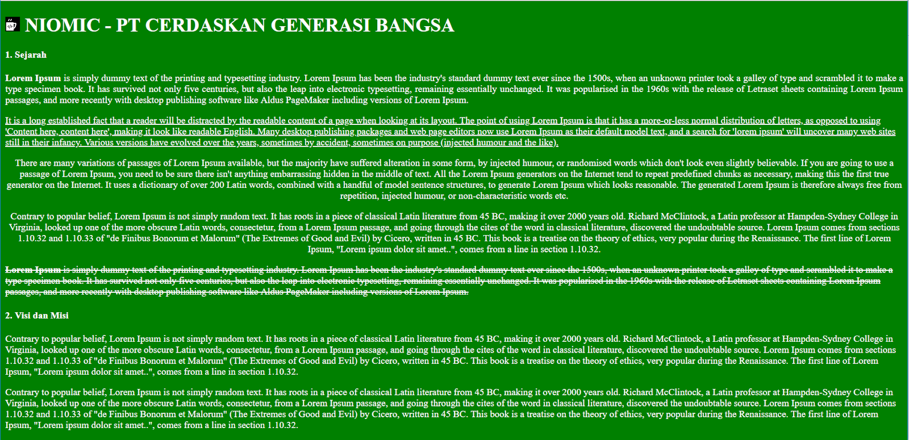

# TUGAS 2 CSS
1. Silahkan download file HTML pada link ini : https://drive.google.com/open?id=1pIaQ6DFC1QERdTAQc2uBpG7-4Ac8R7dM  
2. Buatlah file css dengan nama “Style.css”  
3. Silahkan tuliskan element selector H1 didalam file Style.css lalu tulislah kode CSS berikut ini :  
```
text-transform: capitalize;
```
4. Silahkan tuliskan class selector dengan nama “p_pertama” didalam file Style.css lalu tulislah kode CSS berikut :  
```
text-align: justify;
```
5. Silahkan tuliskan ID selector dengan nama “p_kedua” didalam file Style.css lalu tulislah kode CSS berikut :  
```
text-decoration: underline;
```
6. Silahkan tuliskan Universal selector didalam file Style.css lalu tulislah kode CSS berikut :  
```
color: white;
background-color: green;
```
7. Silahkan tuliskan group selector dengan nama “p_tiga” dan “p_empat” didalam file Style.css lalu tulislah kode CSS berikut :  
```
text-align: center;
```
8. Silahkan tuliskan Spesific selector dengan nama class “p_lima” didalam file Style.css lalu tulislah kode CSS berikut :  
```
text-decoration: line-through;
```
9. Silahkan masukan kode CSS kedalam tag HTML sesuai dengan urutan paragraf, misal “p_satu” sama dengan paragraf pertama dan seterusnya.  
10. Silahkan dijalankan maka hasil yang tertampil akan seperti ini :  

